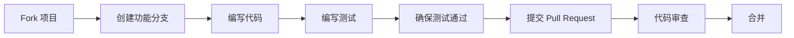

# CONTRIBUTING.md

# 贡献指南 🤝

首先，感谢你考虑为 **AgencyOS** 做出贡献！正是像你这样的社区成员的帮助，才能使 **AgencyOS** 成为更好的面向物理世界的自主智能体操作系统。

这份指南将帮助你了解如何参与项目、贡献流程以及我们的一些约定。

## 快速导航

- [行为准则](#行为准则)
- [我如何贡献？](#我如何贡献)
  - [报告 Bug](#报告-bug)
  - [提出新功能](#提出新功能)
  - [提交代码](#提交代码)
  - [改进文档](#改进文档)
  - [参与讨论](#参与讨论)
- [开发环境搭建](#开发环境搭建)
- [代码规范](#代码规范)
- [提交信息规范](#提交信息规范)
- [Pull Request 流程](#pull-request-流程)
- [许可证](#许可证)

## 行为准则

我们采用 [Contributor Covenant](https://www.contributor-covenant.org/) 作为我们的行为准则。我们希望所有参与者都能遵守，营造一个开放、友好的社区环境。简而言之：**善待彼此**。

完整的准则内容请查看项目根目录的 [CODE_OF_CONDUCT.md](CODE_OF_CONDUCT.md) 文件。

## 我如何贡献？

### 报告 Bug

如果你在使用过程中发现了 Bug，欢迎通过 [GitHub Issues](https://github.com/agencyos-cn/agentic-core/issues) 报告。在提交前，请先搜索一下是否已有相同问题的报告。

**一个好的 Bug 报告应该包含：**

- **清晰的标题**：简要描述问题
- **环境信息**：操作系统、Python 版本、AgencyOS 版本等
- **复现步骤**：详细描述如何复现该问题
- **期望行为**：描述你期望发生的结果
- **实际行为**：描述实际发生的结果
- **日志/截图**：如有，附上相关日志或截图

### 提出新功能

如果你有新想法，同样可以通过 [GitHub Issues](https://github.com/agencyos-cn/agentic-core/issues) 提出。请使用 **Feature request** 模板。

**一个好的功能建议应该包含：**

- **使用场景**：描述你希望解决什么问题
- **预期行为**：描述你期望的功能如何工作
- **替代方案**：描述你考虑过的替代方案
- **附加说明**：任何其他相关信息

### 提交代码

我们欢迎所有形式的代码贡献！无论是一个简单的 Bug 修复，还是一个重要的新功能。

#### 首次贡献者

如果你还不确定从哪里开始，可以查看标有 **`good first issue`** 或 **`help wanted`** 标签的 Issue。这些问题通常比较适合新手。

#### 贡献流程概览



### 改进文档

文档和代码同样重要！如果你发现文档有错误、不清楚的地方，或者有更好的表达方式，欢迎改进。文档文件通常位于 `docs/` 目录或项目根目录下的 `.md` 文件中。

### 参与讨论

有时最好的贡献就是参与讨论！你可以在 [Discussions](https://github.com/agencyos-cn/agentic-core/discussions) 中：

- 帮助回答其他用户的问题
- 分享你使用 AgencyOS 的经验
- 讨论项目的发展方向

## 开发环境搭建

### 前置要求

- Python 3.10 或更高版本
- Git
- （可选）Docker

### 本地开发环境配置

1. **Fork 项目仓库**
   
   点击 GitHub 页面右上角的 **Fork** 按钮，将项目复制到你的 GitHub 账号下。

2. **克隆你的 Fork**
   ```bash
   git clone https://github.com/你的用户名/agentic-core.git
   cd agentic-core
   ```

3. **添加上游仓库**
   ```bash
   git remote add upstream https://github.com/agencyos-cn/agentic-core.git
   ```

4. **创建虚拟环境**
   ```bash
   python -m venv venv
   source venv/bin/activate  # Linux/Mac
   # 或
   .\venv\Scripts\activate  # Windows
   ```

5. **安装开发依赖**
   ```bash
   pip install -e ".[dev]"
   ```

6. **运行测试**
   ```bash
   pytest
   ```

## 代码规范

我们遵循以下代码规范，以确保代码风格的一致性：

### Python

- 遵循 [PEP 8](https://www.python.org/dev/peps/pep-0008/) 编码规范
- 使用 [Black](https://github.com/psf/black) 作为代码格式化工具
- 使用 [isort](https://github.com/PyCQA/isort) 对导入进行排序
- 使用 [Flake8](https://github.com/PyCQA/flake8) 进行代码检查
- 类型注解：尽可能使用类型注解，并用 [mypy](https://github.com/python/mypy) 检查

### 文档字符串

我们使用 Google 风格的文档字符串：

```python
def function_name(param1: str, param2: int) -> bool:
    """简要描述函数功能。

    Args:
        param1 (str): 参数1的描述
        param2 (int): 参数2的描述

    Returns:
        bool: 返回值的描述

    Raises:
        ValueError: 何时会抛出此异常
    """
```

### 测试

- 所有新功能都应包含相应的测试
- 测试使用 [pytest](https://docs.pytest.org/) 框架
- 测试文件应放在 `tests/` 目录下，命名格式为 `test_*.py`
- 确保测试覆盖率达到 80% 以上

## 提交信息规范

我们采用 [Conventional Commits](https://www.conventionalcommits.org/) 规范，以便于生成变更日志和版本管理。

### 格式

```
<类型>[可选作用域]: <描述>

[可选正文]

[可选脚注]
```

### 常用类型

| 类型 | 用途 |
|:---|:---|
| **feat** | 新功能 |
| **fix** | 修复 Bug |
| **docs** | 文档更新 |
| **style** | 代码格式调整（不影响代码逻辑） |
| **refactor** | 代码重构 |
| **perf** | 性能优化 |
| **test** | 测试相关 |
| **chore** | 构建过程或辅助工具的变动 |

### 示例

```
feat(core): 添加意图理解引擎

- 实现基于 LLM 的意图解析
- 支持多轮对话上下文

Closes #123
```

```
docs: 更新贡献指南

添加开发环境搭建步骤
```

## Pull Request 流程

1. **确保你的 Fork 是最新的**
   ```bash
   git checkout main
   git pull upstream main
   ```

2. **创建功能分支**
   ```bash
   git checkout -b feat/你的功能名称
   # 或
   git checkout -b fix/你修复的问题
   ```

3. **编写代码和测试**

4. **确保测试通过**
   ```bash
   pytest
   flake8
   mypy .
   ```

5. **提交变更**
   ```bash
   git add .
   git commit -m "feat: 你的提交信息"
   ```

6. **推送到你的 Fork**
   ```bash
   git push origin feat/你的功能名称
   ```

7. **创建 Pull Request**
   
   在 GitHub 上，进入你的 Fork 仓库页面，点击 **Pull Request** 按钮，填写必要信息后提交。

### Pull Request 检查清单

- [ ] 代码遵循项目规范
- [ ] 已添加/更新测试
- [ ] 所有测试通过
- [ ] 文档已更新（如有必要）
- [ ] 提交信息符合规范

## 许可证

通过向 **AgencyOS** 提交贡献，你同意你的贡献将遵循项目的 [Apache 2.0](LICENSE) 许可证。

---

## 再次感谢

感谢你愿意花时间为 **AgencyOS** 做贡献。你的每一份努力，都在帮助构建一个更开放、更智能的未来。

**AgencyOS 团队**