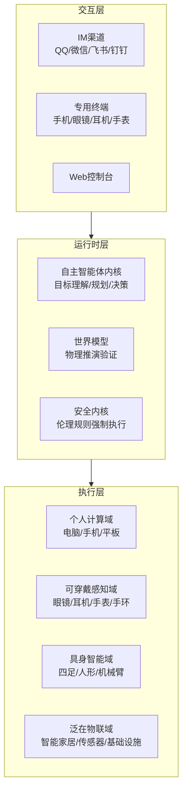
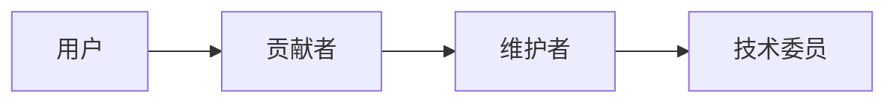

# AgencyOS 中国社区 🇨🇳

<div align="center">

**面向物理世界的自主智能体操作系统**

[](https://github.com/agencyos-cn/agencyos-core)
[](LICENSE)
[](https://arxiv.org/abs/2403.12345)
[](https://twitter.com/AgencyOS)

[官网](https://agencyos.cn) • [文档](https://docs.agencyos.cn) • [社区](https://community.agencyos.cn) • [企业版](https://enterprise.agencyos.com.cn)

</div>

---

## 🌟 项目愿景

让每个人都能拥有一个真正的“Agentic Companion”——它理解你的语言，调用你的设备，连接全世界的智能体技能，从数字世界到物理世界，无处不在。

### 什么是 Agentic Companion？

| 特质 | 含义 |
|:---|:---|
| **Agentic** | 具备自主目标设定、规划决策、环境适应能力 |
| **Companion** | 以陪伴、信任、理解为关系核心 |
| **Personal** | 属于你个人，伴随你一生 |
| **Embodied** | 能通过设备感知和作用于物理世界 |


> **“未来的操作系统将从 GUI 转向 NUI（自然用户界面），从应用转向技能，从被动响应转向主动服务。”**

AgencyOS 不是又一个智能体框架，而是**智能体时代的操作系统**——它管理的不再是 CPU 和内存，而是智能体的“能动性”（Agency）。

---

## 🎯 核心定位，AgencyOS VS 传统 Agent 框架

| 维度 | AgencyOS | 传统 Agent 框架 |
|:---|:---|:---|
| **本质** | 智能体运行时环境 | 智能体开发库 |
| **状态** | 持久化、跨设备同步 | 需开发者手动管理 |
| **设备** | 原生支持四大执行域 | 通过工具间接调用 |
| **世界模型** | 内置物理推演引擎 | 无 |
| **安全** | 安全内核强制执行 | 需自行实现沙箱 |

---

## 🏗️ 整体架构



---

### 四大执行域

| 执行域 | 设备类型 | 核心能力 | 典型场景 |
|:---|:---|:---|:---|
| **个人计算域** | 电脑、手机、平板 | 数字世界操作 | 文档处理、邮件发送 |
| **可穿戴感知域** | 眼镜、耳机、手表、手环 | 人体感知、自然交互 | AR导航、健康监测 |
| **具身智能域** | 四足/人形/机械臂 | 物理移动、物体操作 | 取快递、叠被子 |
| **泛在物联域** | 智能家居、传感器 | 环境控制、状态监测 | 智能家居、智慧城市 |

---

## 🧩 行为单元四层模型

| 层次 | 定义 | 示例 | 开发者角色 |
|:---|:---|:---|:---|
| **任务 (Task)** | 顶层用户目标 | “取快递”、“准备晚餐” | 场景开发者 |
| **技能 (Skill)** | 可复用行为单元 | “导航到驿站”、“扫码取件” | 技能开发者 |
| **服务 (Service)** | 运行时功能组件 | “路径规划服务” | 算法开发者 |
| **原语 (Primitive)** | 硬件原子操作 | “左腿向前迈15厘米” | 硬件厂商 |

---

## 🚀 快速开始

### 环境要求
- Python 3.10+
- Docker 20.10+ (可选)
- 8GB+ RAM (推荐)

### 一分钟体验

```bash
# 1. 安装 AgencyOS 内核
pip install agencyos

# 2. 初始化工作空间
agencyos init my-workspace
cd my-workspace

# 3. 运行第一个智能体
agencyos run "明天上午提醒我开会"
```

### Docker 部署

```bash
docker run -d \
  --name agencyos \
  -p 18789:18789 \
  -v ./workspace:/workspace \
  agencyos/agentic-core:latest
```

---

## 📚 核心文档

- [架构详解](https://docs.agencyos.cn/architecture) - 深入理解四大执行域
- [开发者指南](https://docs.agencyos.cn/dev-guide) - 如何开发自己的技能
- [API 参考](https://docs.agencyos.cn/api) - 完整的 API 文档
- [最佳实践](https://docs.agencyos.cn/best-practices) - 生产环境部署指南

---

## 🌍 生态市场

| 市场 | 地址 | 说明 |
|:---|:---|:---|
| **技能市场** | [hub.agencyos.cn/skills](https://hub.agencyos.cn/skills) | 可复用的行为单元 |
| **数据集市场** | [hub.agencyos.cn/datasets](https://hub.agencyos.cn/datasets) | 机器人训练数据 |
| **世界模型市场** | [hub.agencyos.cn/models](https://hub.agencyos.cn/models) | 预训练环境模型 |

---

## 🤝 社区与贡献

AgencyOS 是一个开放治理的开源项目，欢迎所有人参与！

### 贡献方式

- 📝 [提交 Issue](https://github.com/agencyos-cn/agencyos-core/issues) - 报告 bug 或提出新功能
- 🔧 [提交 PR](https://github.com/agencyos-cn/agencyos-core/pulls) - 修复问题或添加功能
- 📖 [完善文档](https://github.com/agencyos-cn/docs) - 帮助更多人理解
- 💬 [参与讨论](https://community.agencyos.cn) - 分享你的想法

### 贡献者阶梯



### 行为准则

我们遵守 [Contributor Covenant](https://www.contributor-covenant.org/) 行为准则，营造友好、包容的社区环境。

---

## 📅 路线图

| 阶段 | 时间 | 核心任务 |
|:---|:---|:---|
| **Phase 1** | 2026 Q2 | 内核开源 + 基础技能库 |
| **Phase 2** | 2026 Q3 | 四大执行域适配器 |
| **Phase 3** | 2026 Q4 | 行为单元市场上线 |
| **Phase 4** | 2027 Q1 | 企业版发布 |
| **Phase 5** | 2027 Q2+ | 开放治理，基金会筹备 |

---

## 📄 许可证

AgencyOS 内核采用 **Apache 2.0** 许可证，技能市场中的第三方技能遵循各自的许可证。

---

## 🌐 我们的品牌矩阵

| 资产 | 地址 | 用途 |
|:---|:---|:---|
| **官网** | [agencyos.cn](https://agencyos.cn) | 项目门户 |
| **GitHub** | [github.com/agencyos-cn](https://github.com/agencyos-cn) | **中国社区技术基地** |
| **Twitter/X** | [@AgencyOS](https://twitter.com/AgencyOS) | 国际传播 |
| **文档** | [docs.agencyos.cn](https://docs.agencyos.cn) | 技术文档 |
| **社区** | [community.agencyos.cn](https://community.agencyos.cn) | 开发者论坛 |
| **企业版** | [enterprise.agencyos.com.cn](https://enterprise.agencyos.com.cn) | 商业产品 |

---

<div align="center">

**让每个智能体都能在物理世界中自由行动**

[GitHub](https://github.com/agencyos-cn) • [Twitter](https://twitter.com/AgencyOS) • [Discord](https://discord.gg/agencyos) • [知乎](https://zhihu.com/org/agencyos)

⭐ 如果这个项目对你有启发，请给我们一个 Star！

</div>

## 🚧 项目状态说明

**AgencyOS 目前处于学术研究与工程开发并行阶段。**

- ✅ 本项目（`agentic-core`）的架构设计、概念验证代码和开发者文档已**完全开源**（Apache 2.0）
- 📝 核心算法实现和实验代码将在相关学术论文发表后陆续开源
- 🤝 如果您是学术研究者并希望提前访问核心模块进行合作研究，欢迎通过 [GitHub Issues](https://github.com/agencyos-cn/agentic-core/issues) 或邮件联系我们

我们坚信开放协作的力量，同时也尊重学术发表的规律。感谢您的理解和支持！

## 📬 联系与贡献

### 问题反馈
如果你遇到任何问题或有改进建议，欢迎通过以下方式联系我们：

- **提交 Issue**：[github.com/agencyos-cn/agentic-core/issues](https://github.com/agencyos-cn/agentic-core/issues)
- **参与讨论**：[github.com/agencyos-cn/agentic-core/discussions](https://github.com/agencyos-cn/agentic-core/discussions)
- **邮件联系**：contact@agencyos.cn（项目公共邮箱）

### 贡献指南
我们欢迎任何形式的贡献！请查看 [CONTRIBUTING.md](CONTRIBUTING.md) 了解如何参与。

### 版权声明
Copyright © 2026 AgencyOS Project. 本项目采用 **Apache 2.0** 许可证。

*AgencyOS 是一个开放社区驱动的项目，我们相信代码和理念比个人身份更重要。*

Definition 1 (Agentic Companion). An Agentic Companion is a persistent, personalized autonomous agent that (1) represents a single human user, (2) maintains a continuous digital self across devices and time, (3) possesses agency to set goals and make decisions aligned with user preferences, and (4) can perceive and act upon both digital and physical environments through a distributed network of personal, wearable, embodied, and IoT devices.

---

## 📁 项目结构

```
agentic-core/
├── 📄 LICENSE                   # Apache 2.0 许可证
├── 📄 README.md                 # 项目入口（指向 docs）
├── 📄 pyproject.toml            # 项目依赖配置
├── 📄 requirements.txt          # pip 依赖清单
│
├── 📁 docs/                      # 文档目录
│   ├── 📄 README.md              # 完整文档首页
│   ├── 📄 CONTRIBUTING.md        # 贡献指南
│   ├── 📄 CODE_OF_CONDUCT.md     # 行为准则
│   ├── 📄 COMMIT_CONVENTION.md   # 提交规范
│   ├── 📄 SECURITY.md            # 安全策略
│   ├── 📄 CHANGELOG.md           # 变更日志
│   ├── 📄 INSTALL.md             # 安装说明
│   ├── 📄 project-summary.md     # 项目总结
│   ├── 📄 architecture.md        # 架构设计
│   ├── 📄 api-reference.md       # API 参考
│   └── 📁 tutorials/              # 教程目录
│
├── 📁 src/                       # 源代码
│   ├── 📁 core/                   # 核心运行时
│   ├── 📁 skills/                  # 技能系统
│   ├── 📁 devices/                 # 设备抽象层
│   └── 📁 utils/                   # 工具函数
│
├── 📁 tests/                      # 测试目录
├── 📁 examples/                   # 示例代码
├── 📁 .github/                    # GitHub 配置
└── 📁 .continue/                  # Continue 插件配置
```

