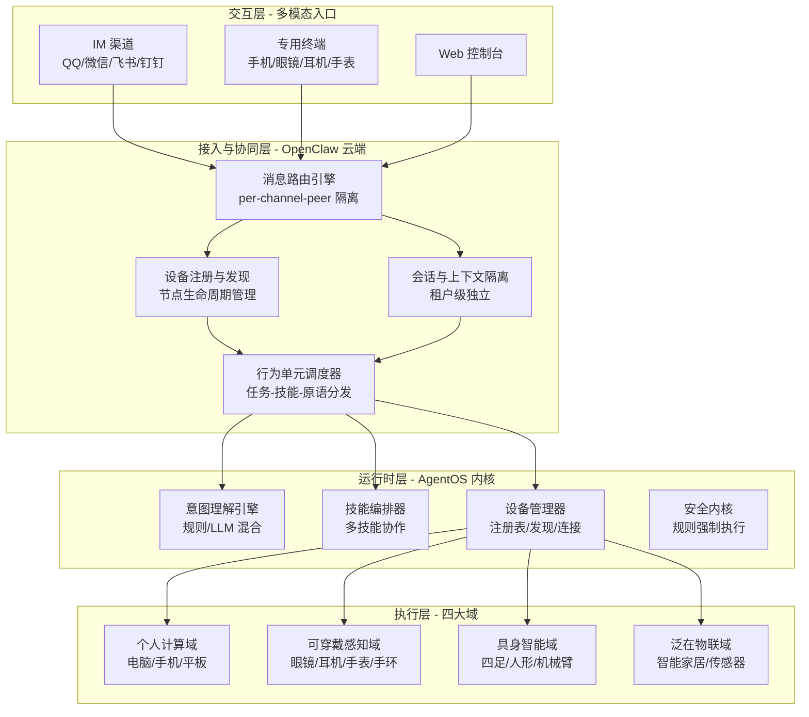
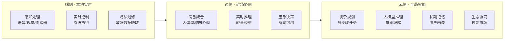

# AgencyOS 项目完整技术文档

## 版本：1.0 | 最后更新：2026-03-17

---

# 第一部分：项目概述与愿景

## 1.1 核心愿景

> **“让每个人都能拥有一个真正的智能伙伴（Agentic Companion）——它理解你的语言，调用你的设备，连接全世界的智能体技能，从数字世界到物理世界，无处不在。”**

## 1.2 核心理念

**“未来的操作系统将从 GUI 转向 NUI（自然用户界面），从应用转向技能，从被动响应转向主动服务。”**

AgencyOS 不是又一个智能体框架，而是**智能体时代的操作系统**——它管理的不再是 CPU 和内存，而是智能体的“能动性”（Agency）。

## 1.3 三层价值主张

| 层级 | 价值 | 面向用户 |
|:---|:---|:---|
| **终端用户** | 一句话搞定一切：取快递、发邮件、控家居、调机器人 | 个人消费者 |
| **技能开发者** | 一次开发，多处调用，按次收费 | 独立开发者、AI 公司 |
| **设备厂商** | 即插即用，设备能力变现 | 机器人厂商、智能硬件商 |

## 1.4 品牌体系

| 资产 | 地址 | 用途 |
|:---|:---|:---|
| **官网** | [agencyos.cn](https://agencyos.cn) | 项目门户 |
| **GitHub** | [github.com/agencyos-cn](https://github.com/agencyos-cn) | 中国社区技术基地 |
| **Twitter/X** | [@AgencyOS](https://twitter.com/AgencyOS) | 国际传播 |
| **文档** | [docs.agencyos.cn](https://docs.agencyos.cn) | 技术文档 |
| **社区** | [community.agencyos.cn](https://community.agencyos.cn) | 开发者论坛 |
| **企业版** | [enterprise.agencyos.com.cn](https://enterprise.agencyos.com.cn) | 商业产品 |
| **项目邮箱** | contact@agencyos.cn | 官方联系 |

---

# 第二部分：核心概念与术语体系

## 2.1 统一术语体系

| 术语 | 定义 |
|:---|:---|
| **Agentic Companion** | 用户的个人智能伙伴，具备自主性、能动性，代表用户执行任务 |
| **自主智能体** | 能够感知环境、基于目标独立评估决策并采取行动的系统 |
| **具身智能系统** | 拥有物理“身体”和 AI“大脑”，能与物理环境交互的智能系统 |
| **行为单元** | 任务、技能、服务、原语四层架构 |
| **原语** | 硬件能力的原子抽象，不可分割的最小执行单元 |
| **世界模型** | 对物理世界的演化认知表征，用于推演验证 |
| **安全内核** | 保障系统行为合规安全的强制执行层 |

## 2.2 行为单元四层模型

| 层次 | 定义 | 示例 | 开发者角色 |
|:---|:---|:---|:---|
| **任务 (Task)** | 顶层用户目标 | “取快递”、“准备晚餐” | 场景开发者 |
| **技能 (Skill)** | 可复用行为单元 | “导航到驿站”、“扫码取件” | 技能开发者 |
| **服务 (Service)** | 运行时功能组件 | “路径规划服务” | 算法开发者 |
| **原语 (Primitive)** | 硬件原子操作 | “左腿向前迈15厘米” | 硬件厂商 |

## 2.3 四大执行域

| 执行域 | 设备类型 | 核心能力 | 典型场景 |
|:---|:---|:---|:---|
| **个人计算域** | 电脑、手机、平板 | 数字世界操作 | 文档处理、邮件发送 |
| **可穿戴感知域** | 智能眼镜、耳机、手表、手环 | 人体感知、自然交互 | AR 导航、健康监测 |
| **具身智能域** | 四足/人形机器人、机械臂 | 物理移动、物体操作 | 取快递、叠被子 |
| **泛在物联域** | 智能家居、传感器、基础设施 | 环境控制、状态监测 | 智能家居、智慧城市 |

---

# 第三部分：系统架构设计

## 3.1 整体架构图



## 3.2 端-边-云连续体



## 3.3 多租户隔离架构

| 隔离层 | 技术实现 |
|:---|:---|
| **会话层** | OpenClaw `per-channel-peer` 作用域 |
| **数据库层** | PostgreSQL Row-Level Security (RLS) |
| **缓存层** | Redis Key 前缀隔离 |
| **向量库层** | Collection 命名空间隔离 |
| **文件存储层** | MinIO 多租户 Bucket 策略 |

---

# 第四部分：核心模块实现

## 4.1 项目文件结构

```
agentic-core/
│
├── 📄 LICENSE                   # Apache 2.0（根目录）
├── 📄 pyproject.toml            # 项目依赖（根目录）
│
├── 📁 .github/                   # GitHub 专用配置
│   ├── 📄 CODEOWNERS
│   └── 📁 workflows/
├── 📁 docs/                      # 文档目录
│   ├── 📄 README.md              # 项目介绍
│   ├── 📄 CONTRIBUTING.md        # 贡献指南
│   ├── 📄 CODE_OF_CONDUCT.md     # 行为准则
│   ├── 📄 COMMIT_CONVENTION.md   # 提交规范
│   ├── 📄 SECURITY.md            # 安全策略
│   ├── 📄 CHANGELOG.md           # 版本变更记录
│   ├── 📄 INSTALL.md             # 安装说明
│   └── 📄 project-summary.md     # 项目总结
│
├── 📁 src/                       # 源代码
│   ├── 📄 __init__.py
│   │
│   ├── 📁 core/                   # 核心运行时
│   │   ├── 📄 __init__.py
│   │   ├── 📄 runtime.py          # AgentRuntime 类
│   │   ├── 📄 intent_engine.py    # 意图理解引擎
│   │   └── 📄 orchestrator.py     # 技能编排器
│   │
│   ├── 📁 skills/                  # 技能管理
│   │   ├── 📄 __init__.py
│   │   ├── 📄 base.py              # 技能基类
│   │   ├── 📄 registry.py          # 技能注册表
│   │   ├── 📄 device_controller.py # 设备控制技能
│   │   └── 📄 query_handler.py     # 查询处理技能
│   │
│   └── 📁 devices/                  # 设备抽象层
│       ├── 📄 __init__.py
│       ├── 📄 base.py               # 设备基类
│       ├── 📄 registry.py           # 设备注册表
│       ├── 📄 discovery.py          # 设备发现
│       ├── 📄 connection.py         # 连接管理
│       └── 📁 examples/
│           └── 📄 smart_light.py    # 智能灯泡示例
│
├── 📁 tests/                       # 测试
│   ├── 📄 test_devices.py
│   ├── 📄 test_connection.py
│   └── 📄 websocket_server.py       # WebSocket 测试服务器
│
│
└── 📁 examples/                     # 示例代码
    └── 📁 basic/
│   └── ...
├── 📁 tests/                      # 测试
│   └── ...
```

## 4.2 核心运行时 (Core Runtime)

### 4.2.1 AgentRuntime 类

```python
# src/core/runtime.py
class AgentRuntime:
    """智能体运行时核心类"""
    
    def __init__(self, config: Optional[Dict] = None):
        self.config = config or {}
        self.intent_engine = None
        self.skill_orchestrator = None
        self.device_registry = None
        self._initialized = False
    
    async def initialize(self):
        """初始化所有组件"""
        self.intent_engine = IntentEngine(self.config.get("model", {}))
        self.skill_orchestrator = SkillOrchestrator(self.config.get("skills", {}))
        self.device_registry = DeviceRegistry()
        await self.intent_engine.initialize()
        await self.skill_orchestrator.initialize()
        self._initialized = True
    
    async def process(self, user_input: str, context: RuntimeContext) -> Dict[str, Any]:
        """处理用户输入"""
        # 1. 意图理解
        intent = await self.intent_engine.parse(user_input, context)
        # 2. 技能编排
        plan = await self.skill_orchestrator.create_plan(intent, context)
        # 3. 执行计划
        result = await self._execute_plan(plan, context)
        return result
```

### 4.2.2 意图理解引擎

```python
# src/core/intent_engine.py
class IntentEngine:
    """意图理解引擎 - 支持规则和LLM两种模式"""
    
    async def parse(self, user_input: str, context) -> Dict[str, Any]:
        # 规则解析（快速通道）
        intent = self._rule_based_parse(user_input)
        
        # 如果需要云侧处理或规则置信度低，调用LLM
        if intent.get("needs_cloud", False):
            llm_intent = await self._llm_parse(user_input, context)
            return llm_intent
        return intent
    
    def _rule_based_parse(self, text: str) -> Dict[str, Any]:
        """基于规则的快速意图解析"""
        text_lower = text.lower()
        if any(word in text_lower for word in ["开灯", "关灯", "空调"]):
            return {"type": "device_control", "confidence": 0.7}
        elif any(word in text_lower for word in ["天气", "时间"]):
            return {"type": "query", "confidence": 0.6}
        return {"type": "unknown", "confidence": 0.1, "needs_cloud": True}
```

### 4.2.3 技能编排器

```python
# src/core/orchestrator.py
class SkillOrchestrator:
    """技能编排器 - 发现、加载和调用技能"""
    
    def __init__(self, config: Optional[Dict] = None):
        self.config = config or {}
        self.skills = {}  # skill_name -> skill_instance
        self.skill_paths = self.config.get("paths", ["skills"])
    
    async def create_plan(self, intent: Dict[str, Any], context) -> Dict[str, Any]:
        """根据意图创建执行计划"""
        intent_type = intent.get("type", "unknown")
        if intent_type == "device_control":
            return {
                "steps": [{"skill": "device_controller", "params": intent}],
                "response": "正在处理设备控制请求"
            }
        elif intent_type == "query":
            return {
                "steps": [{"skill": "query_handler", "params": intent}],
                "response": "正在查询..."
            }
        return {"steps": [], "response": "抱歉，我还不能理解这个请求"}
    
    async def execute_skill(self, skill_name: str, params: Dict, context) -> Any:
        """执行单个技能"""
        skill = self.skills.get(skill_name)
        if not skill:
            logger.warning(f"Skill {skill_name} not found")
            return {"error": f"Skill {skill_name} not found"}
        return await skill.execute(params, context)
```

## 4.3 技能系统 (Skills)

### 4.3.1 技能基类

```python
# src/skills/base.py
class BaseSkill(ABC):
    """所有技能的抽象基类"""
    
    def __init__(self, skill_id: str = None, name: str = None, version: str = "0.1.0"):
        self.skill_id = skill_id or getattr(self.__class__, "skill_id", self.__class__.__name__.lower())
        self.name = name or getattr(self.__class__, "name", self.__class__.__name__)
        self.version = version or getattr(self.__class__, "version", "0.1.0")
        self.config = {}
    
    @abstractmethod
    async def execute(self, params: Dict[str, Any], context) -> Dict[str, Any]:
        """执行技能的核心方法"""
        pass
```

### 4.3.2 技能注册表

```python
# src/skills/registry.py
class SkillRegistry:
    """技能注册表 - 管理所有可用的技能类"""
    
    def __init__(self):
        self._skills_by_id: Dict[str, Type[BaseSkill]] = {}
        self._skills_by_name: Dict[str, str] = {}
    
    def register(self, skill_class: Type[BaseSkill], skill_id: Optional[str] = None):
        """注册一个技能类"""
        skill_id = skill_id or getattr(skill_class, "skill_id", skill_class.__name__.lower())
        self._skills_by_id[skill_id] = skill_class
        self._skills_by_name[getattr(skill_class, "name", skill_class.__name__)] = skill_id
    
    def create_instance(self, skill_id: str, **kwargs) -> Optional[BaseSkill]:
        """创建技能实例"""
        skill_class = self._skills_by_id.get(skill_id)
        return skill_class(**kwargs) if skill_class else None
```

### 4.3.3 已实现的技能

**DeviceController** (`device_controller.py`):
```python
class DeviceController(BaseSkill):
    skill_id = "device_controller"
    name = "设备控制器"
    version = "0.1.0"
    
    async def execute(self, params: Dict[str, Any], context) -> Dict[str, Any]:
        intent_text = params.get('intent', '')
        if '开灯' in intent_text:
            return {"success": True, "message": "已为您打开灯光"}
        elif '关灯' in intent_text:
            return {"success": True, "message": "已为您关闭灯光"}
        return {"success": False, "message": f"暂不支持控制: {intent_text}"}
```

**QueryHandler** (`query_handler.py`):
```python
class QueryHandler(BaseSkill):
    skill_id = "query_handler"
    name = "查询处理器"
    version = "0.1.0"
    
    async def execute(self, params: Dict[str, Any], context) -> Dict[str, Any]:
        intent_text = params.get('intent', '')
        if '天气' in intent_text:
            return {"success": True, "message": "今天天气晴朗，25℃"}
        elif '时间' in intent_text:
            import datetime
            now = datetime.datetime.now()
            return {"success": True, "message": f"现在是 {now.hour}:{now.minute:02d}"}
        return {"success": True, "message": f"您查询的是：{intent_text}"}
```

## 4.4 设备抽象层 (Devices)

### 4.4.1 核心数据结构

```python
# src/devices/base.py
class DeviceType(Enum):
    LIGHT = "light"
    SENSOR = "sensor"
    ACTUATOR = "actuator"
    ROBOT = "robot"
    WEARABLE = "wearable"
    CAMERA = "camera"

class DeviceStatus(Enum):
    ONLINE = "online"
    OFFLINE = "offline"
    BUSY = "busy"
    ERROR = "error"
    DISCOVERED = "discovered"

class CapabilityType(Enum):
    # 感知能力
    VISION = "vision"
    AUDIO = "audio"
    TEMPERATURE = "temperature"
    # 执行能力
    SWITCH = "switch"
    DIMMER = "dimmer"
    MOTOR = "motor"
    DISPLAY = "display"
    SPEAK = "speak"

@dataclass
class DeviceCapability:
    type: CapabilityType
    name: str
    version: str = "1.0.0"
    parameters: Dict[str, Any] = field(default_factory=dict)

@dataclass
class DeviceInfo:
    device_id: str
    name: str
    type: DeviceType
    manufacturer: Optional[str] = None
    model: Optional[str] = None
    capabilities: List[DeviceCapability] = field(default_factory=list)
    connection_params: Dict[str, Any] = field(default_factory=dict)
    status: DeviceStatus = DeviceStatus.DISCOVERED
```

### 4.4.2 设备基类

```python
# src/devices/base.py
class BaseDevice(ABC):
    """所有设备的抽象基类"""
    
    def __init__(self, device_info: DeviceInfo):
        self.info = device_info
        self._connection = None
        self._lock = asyncio.Lock()
    
    @abstractmethod
    async def connect(self) -> bool:
        """连接到设备"""
        pass
    
    @abstractmethod
    async def disconnect(self) -> bool:
        """断开连接"""
        pass
    
    def has_capability(self, capability_type: CapabilityType) -> bool:
        return any(cap.type == capability_type for cap in self.info.capabilities)
    
    async def execute(self, capability_type: CapabilityType, **params) -> Dict[str, Any]:
        """执行设备能力"""
        if not self.has_capability(capability_type):
            raise ValueError(f"Device does not support {capability_type}")
        async with self._lock:
            self.info.status = DeviceStatus.BUSY
            try:
                return await self._execute_impl(capability_type, params)
            finally:
                self.info.status = DeviceStatus.ONLINE
    
    @abstractmethod
    async def _execute_impl(self, capability_type: CapabilityType, params: Dict) -> Dict[str, Any]:
        """实际执行能力（子类实现）"""
        pass
```

### 4.4.3 设备注册表

```python
# src/devices/registry.py
class DeviceRegistry:
    """设备注册表 - 管理设备生命周期"""
    
    def __init__(self):
        self._devices: Dict[str, BaseDevice] = {}
        self._device_info: Dict[str, DeviceInfo] = {}
        self._status_callbacks = []
    
    def register_device(self, device: BaseDevice):
        self._devices[device.info.device_id] = device
        self._device_info[device.info.device_id] = device.info
    
    def get_device(self, device_id: str) -> Optional[BaseDevice]:
        return self._devices.get(device_id)
    
    def list_devices(self, status: Optional[DeviceStatus] = None) -> List[DeviceInfo]:
        if status:
            return [info for info in self._device_info.values() if info.status == status]
        return list(self._device_info.values())
    
    def find_devices_by_capability(self, capability_type) -> List[DeviceInfo]:
        return [info for dev_id, dev in self._devices.items() 
                if dev.has_capability(capability_type)]
```

### 4.4.4 设备发现

```python
# src/devices/discovery.py
class DeviceDiscovery:
    """设备发现管理器"""
    
    def __init__(self):
        self._discovered_devices = {}
        self._listeners = []
    
    async def start_discovery(self, config: DiscoveryConfig) -> List[Dict]:
        """启动设备发现"""
        tasks = []
        for protocol in config.protocols:
            if protocol == DiscoveryProtocol.UDP:
                tasks.append(self._discover_udp(config.timeout))
            elif protocol == DiscoveryProtocol.MDNS:
                tasks.append(self._discover_mdns(config.timeout))
        
        results = await asyncio.gather(*tasks, return_exceptions=True)
        # 合并结果并通知监听器
        return list(self._discovered_devices.values())
    
    async def _discover_udp(self, timeout: int) -> List[Dict]:
        """UDP广播发现"""
        sock = socket.socket(socket.AF_INET, socket.SOCK_DGRAM)
        sock.setsockopt(socket.SOL_SOCKET, socket.SO_BROADCAST, 1)
        sock.settimeout(timeout)
        
        broadcast_msg = json.dumps({"type": "DISCOVER", "version": "1.0"}).encode()
        sock.sendto(broadcast_msg, ('<broadcast>', 18789))
        
        devices = []
        start_time = asyncio.get_event_loop().time()
        while (asyncio.get_event_loop().time() - start_time) < timeout:
            try:
                data, addr = sock.recvfrom(1024)
                device_info = json.loads(data.decode())
                device_info['ip'] = addr[0]
                devices.append(device_info)
            except socket.timeout:
                break
        return devices
```

### 4.4.5 设备连接管理

```python
# src/devices/connection.py
class ConnectionType(Enum):
    TCP = "tcp"
    UDP = "udp"
    WEBSOCKET = "websocket"
    HTTP = "http"
    HTTPS = "https"

class ConnectionStatus(Enum):
    DISCONNECTED = "disconnected"
    CONNECTING = "connecting"
    CONNECTED = "connected"
    ERROR = "error"
    CLOSED = "closed"

@dataclass
class ConnectionConfig:
    connection_type: ConnectionType
    host: Optional[str] = None
    port: Optional[int] = None
    path: Optional[str] = None
    timeout: float = 5.0
    retry_count: int = 3
    retry_delay: float = 1.0
    keepalive: bool = False
    ssl_verify: bool = True

class DeviceConnection:
    """设备连接管理器 - 处理与设备的通信连接"""
    
    def __init__(self, config: ConnectionConfig):
        self.config = config
        self._status = ConnectionStatus.DISCONNECTED
        self._receive_task = None
        self._message_callback = None
        self._error_callback = None
    
    async def connect(self) -> bool:
        """建立连接"""
        self._status = ConnectionStatus.CONNECTING
        try:
            if self.config.connection_type == ConnectionType.TCP:
                await self._connect_tcp()
            elif self.config.connection_type == ConnectionType.UDP:
                await self._connect_udp()
            elif self.config.connection_type == ConnectionType.WEBSOCKET:
                await self._connect_websocket()
            elif self.config.connection_type in [ConnectionType.HTTP, ConnectionType.HTTPS]:
                self._status = ConnectionStatus.CONNECTED
                return True
            
            self._status = ConnectionStatus.CONNECTED
            if self.config.keepalive:
                self._start_keepalive()
            return True
        except Exception as e:
            self._status = ConnectionStatus.ERROR
            if self._error_callback:
                await self._safe_callback(self._error_callback, e)
            return False
    
    async def _connect_tcp(self):
        """建立 TCP 连接"""
        if self.config.connection_type == ConnectionType.HTTPS:
            ssl_context = ssl.create_default_context()
            if not self.config.ssl_verify:
                ssl_context.check_hostname = False
                ssl_context.verify_mode = ssl.CERT_NONE
            reader, writer = await asyncio.open_connection(
                host=self.config.host, port=self.config.port,
                ssl=ssl_context, ssl_handshake_timeout=self.config.timeout
            )
        else:
            reader, writer = await asyncio.open_connection(
                host=self.config.host, port=self.config.port
            )
        self._connection = (reader, writer)
        self._receive_task = asyncio.create_task(self._tcp_receive_loop(reader))
    
    async def send(self, data: Union[str, bytes, dict]) -> bool:
        """发送数据"""
        if self._status != ConnectionStatus.CONNECTED:
            return False
        
        if isinstance(data, dict):
            data = json.dumps(data)
        if isinstance(data, str):
            data = data.encode('utf-8')
        
        try:
            if self.config.connection_type == ConnectionType.TCP:
                self._connection[1].write(data)
                await self._connection[1].drain()
            elif self.config.connection_type == ConnectionType.WEBSOCKET:
                await self._connection.send(data)
            return True
        except Exception as e:
            if self._error_callback:
                await self._safe_callback(self._error_callback, e)
            return False
    
    def set_message_callback(self, callback: Callable[[bytes], Any]):
        self._message_callback = callback
    
    def set_error_callback(self, callback: Callable[[Exception], Any]):
        self._error_callback = callback
    
    async def __aenter__(self):
        await self.connect()
        return self
    
    async def __aexit__(self, exc_type, exc_val, exc_tb):
        await self.disconnect()
```

### 4.4.6 示例设备：智能灯泡

```python
# src/devices/examples/smart_light.py
class SmartLightDevice(BaseDevice):
    """智能灯泡示例设备"""
    
    def __init__(self, device_id: str, name: str, connection_params: Dict = None):
        capabilities = [
            DeviceCapability(type=CapabilityType.SWITCH, name="电源开关"),
            DeviceCapability(type=CapabilityType.DIMMER, name="亮度调节")
        ]
        device_info = DeviceInfo(
            device_id=device_id, name=name, type=DeviceType.LIGHT,
            capabilities=capabilities, connection_params=connection_params or {}
        )
        super().__init__(device_info)
        self._power_on = False
        self._brightness = 50
    
    async def connect(self) -> bool:
        self.info.status = DeviceStatus.ONLINE
        return True
    
    async def disconnect(self) -> bool:
        self.info.status = DeviceStatus.OFFLINE
        return True
    
    async def _execute_impl(self, capability_type: CapabilityType, params: Dict) -> Dict[str, Any]:
        if capability_type == CapabilityType.SWITCH:
            state = params.get("state")
            if state is not None:
                self._power_on = state
                return {"success": True, "state": self._power_on}
        elif capability_type == CapabilityType.DIMMER:
            brightness = params.get("brightness")
            if brightness is not None and 0 <= brightness <= 100:
                self._brightness = brightness
                return {"success": True, "brightness": self._brightness}
        return {"success": False}
```

---

# 第五部分：测试体系

## 5.1 设备层测试

```python
# tests/test_devices.py
async def test_smart_light():
    light = SmartLightDevice("light_001", "客厅灯")
    await light.connect()
    
    result = await light.execute(CapabilityType.SWITCH, state=True)
    assert result["success"] and result["state"] == True
    
    result = await light.execute(CapabilityType.DIMMER, brightness=75)
    assert result["success"] and result["brightness"] == 75
    
    await light.disconnect()

async def test_device_registry():
    registry = DeviceRegistry()
    light1 = SmartLightDevice("light_001", "客厅灯")
    light2 = SmartLightDevice("light_002", "卧室灯")
    
    registry.register_device(light1)
    registry.register_device(light2)
    
    assert len(registry.list_devices()) == 2
    assert len(registry.find_devices_by_capability(CapabilityType.SWITCH)) == 2
```

## 5.2 连接测试

```python
# tests/test_connection.py
async def test_tcp_connection():
    config = ConnectionConfig(
        connection_type=ConnectionType.TCP,
        host="httpbin.org", port=80,
        timeout=5.0
    )
    async with DeviceConnection(config) as conn:
        request = "GET /get HTTP/1.1\r\nHost: httpbin.org\r\nConnection: close\r\n\r\n"
        await conn.send(request)
        await asyncio.sleep(2)

async def test_websocket_connection():
    # 需要先启动本地 WebSocket 服务器
    config = ConnectionConfig(
        connection_type=ConnectionType.WEBSOCKET,
        host="localhost", port=8765,
        path="/", timeout=5.0, keepalive=True
    )
    async with DeviceConnection(config) as conn:
        received = []
        conn.set_message_callback(lambda data: received.append(data.decode()))
        await conn.send("Hello AgencyOS!")
        await asyncio.sleep(1)
        assert len(received) > 0
```

## 5.3 WebSocket 测试服务器

```python
# tests/websocket_server.py
import asyncio
import websockets
import logging

logging.basicConfig(level=logging.INFO)
logger = logging.getLogger(__name__)

async def echo_handler(websocket):
    async for message in websocket:
        logger.info(f"Received: {message[:50]}...")
        await websocket.send(message)

async def main():
    async with websockets.serve(echo_handler, "localhost", 8765):
        logger.info("WebSocket test server running on ws://localhost:8765")
        await asyncio.Future()

if __name__ == "__main__":
    asyncio.run(main())
```

---

# 第六部分：开发环境配置

## 6.1 本地模型集成

### LM Studio 配置

1. 下载 [LM Studio](https://lmstudio.ai/)
2. 加载模型（推荐 `deepseek-coder-6.7b-instruct` Q4_K_M）
3. 启动本地服务器（默认端口 1234）

### Continue 插件配置 (`~/.continue/config.json`)

```json
{
  "models": [
    {
      "title": "LM Studio - Qwen",
      "provider": "lmstudio",
      "model": "qwen3-coder-14b-instruct",
      "apiBase": "http://localhost:1234"
    }
  ],
  "tabAutocompleteModel": {
    "title": "Qwen Coder",
    "provider": "lmstudio",
    "model": "qwen3-coder-14b-instruct",
    "apiBase": "http://localhost:1234"
  },
  "embeddingsProvider": {
    "provider": "lmstudio",
    "model": "nomic-ai/nomic-embed-text-v1.5-GGUF"
  }
}
```

## 6.2 项目依赖 (`pyproject.toml`)

```toml
[project]
name = "agencyos"
version = "0.1.0"
description = "AgencyOS - 面向物理世界的自主智能体操作系统"
authors = [{name = "AgencyOS Contributors", email = "contact@agencyos.cn"}]
license = {text = "Apache-2.0"}
requires-python = ">=3.8"
dependencies = [
    "aiohttp>=3.9.0",
    "websockets>=12.0",
]

[project.optional-dependencies]
dev = [
    "pytest>=7.4.0",
    "pytest-asyncio>=0.21.0",
    "black",
    "isort",
    "flake8",
]
bluetooth = ["bleak>=0.21.0"]
mqtt = ["paho-mqtt>=1.6.0"]
```

---

# 第七部分：Git 提交规范

项目遵循 Angular 提交规范：

```
<type>(<scope>): <description>

[可选正文]

[可选脚注]
```

## 类型说明

| 类型 | 用途 | 示例 |
|:---|:---|:---|
| feat | 新功能 | feat(runtime): 添加意图理解引擎 |
| fix | 修复 Bug | fix(devices): 修复 TCP 连接 SSL 参数错误 |
| docs | 文档 | docs(CONTRIBUTING): 更新贡献指南 |
| test | 测试 | test(devices): 添加设备层测试 |
| refactor | 重构 | refactor(skills): 优化技能基类初始化 |
| chore | 构建/工具 | chore(deps): 更新 aiohttp 到 3.9.0 |

## 常用作用域

| 作用域 | 对应模块 |
|:---|:---|
| core | 核心运行时 |
| skills | 技能管理 |
| devices | 设备抽象层 |
| intent_engine | 意图理解引擎 |
| orchestrator | 技能编排器 |
| connection | 连接管理 |

---

# 第八部分：已完成的里程碑

## ✅ 已完成的工作

| 日期 | 里程碑 | 说明 |
|:---|:---|:---|
| 3月13日 | 项目启动 | 基础架构设计、概念定义 |
| 3月14日 | 品牌建立 | 注册域名 `agencyos.cn`，GitHub 组织 `agencyos-cn` |
| 3月15日 | 核心代码 | 完成 `runtime`、`intent_engine`、`orchestrator` |
| 3月15日 | 技能系统 | 完成 `BaseSkill`、`DeviceController`、`QueryHandler` |
| 3月16日 | 设备抽象层 | 完成 `BaseDevice`、`DeviceRegistry`、`DeviceDiscovery` |
| 3月17日 | 连接管理 | 完成 `DeviceConnection` 支持 TCP/UDP/WebSocket/HTTP |
| 3月17日 | 测试体系 | 所有核心测试通过 |

## 📊 测试通过情况

```bash
# 设备层测试
python tests/test_devices.py
✅ 所有测试通过！

# 连接测试（需要本地 WebSocket 服务器）
python tests/test_connection.py